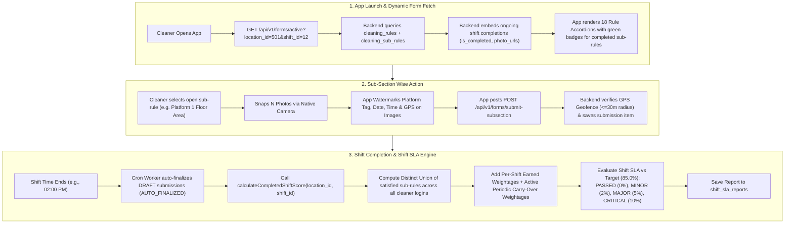

# Complete Architecture & Strategy Discussion Export
## Saafai Industrial Rating Platform & Dynamic Checkpoint Engine

**Project:** Saafai Operations & Rating Platform  
**Target Domain:** Indian Railways & Industrial Facility Management  
**Date:** August 13, 2026  
**Document Location:** `docs/system_architecture/complete_conversation_export.md`

---

## 1. Summary of Project Evolution & Decisions

```
┌────────────────────────────────────────────────────────────────────────────────────────┐
│                                   EVOLUTION TIMELINE                                   │
│                                                                                        │
│ 1. INITIAL STATE    ──► Single Washroom AI Photo Scoring (Not scalable to stations)    │
│ 2. REQUISITE        ──► 18 Global DDR Checkpoints totaling 100% weightage (No AI score)  │
│ 3. UX SIMPLIFICATION ──► Server-Driven Form Engine (No admin zone setup; YES/NO form)  │
│ 4. SUBMISSION FLOW  ──► Sub-section wise submission with N photos (No bulk submit btn)  │
│ 5. SHIFT ENGINE     ──► Multi-cleaner collaborative union of satisfied sub-rules       │
│ 6. LIFECYCLE        ──► Shift expiration auto-finalization (Cron background worker)    │
│ 7. SLA GOVERNANCE   ──► Shift-level target (≥85%) + Intra-shift milestones (T+2h,T+4h)│
│ 8. LOCATION PROOF   ──► Platform section_code + GPS Geofence (30m) + Photo Watermark   │
└────────────────────────────────────────────────────────────────────────────────────────┘
```

---

## 2. Generated System Documents Index

All detailed specifications, schemas, flowcharts, and production Node.js controller code have been organized into the **`docs/system_architecture/`** folder in the project workspace:

1. 📄 **[master_system_architecture.md](file:///e:/GigFactory/saafai/docs/system_architecture/master_system_architecture.md)** — *The single master architectural reference document containing all schemas, API payloads, UI mockups, formulas, code, platform location recognition, and SLA penalty matrix.*
2. 📄 **[activity_lifecycle_flow.md](file:///e:/GigFactory/saafai/docs/system_architecture/activity_lifecycle_flow.md)** — *Visual Mermaid flowcharts for Activity Lifecycle, Shift Score Aggregation, and Daily Audit Rating.*
3. 📄 **[dynamic_form_engine_architecture.md](file:///e:/GigFactory/saafai/docs/system_architecture/dynamic_form_engine_architecture.md)** — *Server-driven form schema generator and sub-section wise submission specs.*
4. 📄 **[flow_comparison.md](file:///e:/GigFactory/saafai/docs/system_architecture/flow_comparison.md)** — *Comparative analysis and flowcharts of Old Washroom AI Flow vs. New Industrial Checkpoint Flow.*

---

## 3. Executive Q&A & Strategy Transcript

### Q1: How do we transition from Washrooms to Industrial Entities (Railway Tracks, Platforms, Concourses)?
**Answer & Strategy:**
* **Old Flow:** Washroom $\rightarrow$ Usage Categories $\rightarrow$ AI Image Scoring.
* **New Flow:** Station Facility $\rightarrow$ 18 Global Checkpoint Rules (totaling 100% weightage) $\rightarrow$ Sub-sections mapped to physical location tags (`section_code: PF_1`, `PF_2`, `CONCOURSE`).
* **Scoring:** Deterministic weighted sum (Binary compliance + photo proof). No black-box AI scores required for official railway audit reports.

---

### Q2: How do we rate single Activity uploads vs. Shift Scores without unfair penalties?
**Answer & Strategy:**
* **3-Tier Scoring Hierarchy:**
  1. **Cleaner Activity Score:** Bounded *only* to the specific sub-sections attempted in that upload batch.
  2. **Shift Score:** Evaluates station cleanliness across the shift duration by taking the **distinct set union of satisfied sub-rules across all cleaner logins**.
  3. **Location Daily Audit Rating:** Evaluates all 18 parameters across 24 hours, incorporating carried-over valid periodic completions.

---

### Q3: What if Cleaner A completes sub-sections 1,2,3 and Cleaner B completes sub-sections 4,5,6,7,8 for the same rule in a shift?
**Answer & Strategy:**
* **Collaborative Union Engine:**
  * Cleaner A completes sub-rules `#101, #102, #103` at 08:30 AM.
  * Cleaner B completes sub-rules `#104, #105, #106, #107, #108` at 11:15 AM.
  * When the shift ends, the backend computes the set union:
    $$\text{Unique Satisfied Sub-rules} = \{101, 102, 103\} \cup \{104, 105, 106, 107, 108\} = \mathbf{8 / 8 \text{ (100\% Complete)}}$$
  * Rule #1 (Scrubbing 46.80%) achieves 100% completion for Shift 1, awarding the full **46.80% weightage** to the shift score!

---

### Q4: How does the dynamic form engine work, and how are submissions sent?
**Answer & Strategy:**
* **No Hardcoded App Forms:** App calls `GET /api/v1/forms/active`. The backend populates the JSON form structure directly from `cleaning_rules` and `cleaning_sub_rules` tables, embedding live ongoing shift completion data (`is_completed`, `completed_by_name`, `photo_urls`).
* **Sub-section Wise Submission:** Cleaners submit data sub-section by sub-section via `POST /api/v1/forms/submit-subsection` with $N$ photos. No `SKIP` or `skip_reason` prompts required.
* **Auto-Resume:** Opening the app pre-fills green checkmarks for items completed by team members so cleaners never lose progress or repeat work.

---

### Q5: What if a cleaner leaves an activity open and the shift time ends?
**Answer & Strategy:**
* **Background Expiration Cron Worker:**
  * Runs every 15 minutes.
  * Finds all un-finalized submissions in `DRAFT` status where `shift.end_time < NOW()`.
  * Automatically updates status to **`AUTO_FINALIZED`**, calculates the final activity score, and seals the data for shift score calculation. No cleaner progress is lost.

---

### Q6: Do cleaners need to complete all 18 items in every shift?
**Answer & Strategy:**
* **NO!** Only **4 parameters (68.90% weightage)** are `PER_SHIFT` requirements:
  * Item #1: Scrubbing & wet cleaning (46.80%) $\rightarrow$ `PER_SHIFT`
  * Item #2: Track Plinth cleaning (20.00%) $\rightarrow$ `PER_SHIFT`
  * Item #10: Staff Toilets (2.00%) $\rightarrow$ `TWICE_PER_SHIFT` (2 Slots per shift)
  * Item #17: Garbage disposal (0.10%) $\rightarrow$ `PER_SHIFT`
* The remaining **14 parameters (31.10% weightage)** are periodic (`DAILY`, `ONCE_IN_TWO_DAYS`, `FORTNIGHTLY`, `MONTHLY`). Once completed within their `validity_hours`, they **automatically carry over 100% weightage credit to all subsequent shifts** without requiring cleaners to re-upload photos!

---

### Q7: How does Shift-Wise SLA Governance and Penalties work?
**Answer & Strategy:**
* **Shift Target Threshold ($\ge 85.0\%$):** Evaluated automatically when a shift completes.
* **Shift Financial Penalty Slabs:**
  * Score $\ge 85.0\% \rightarrow$ **PASSED ✅ (0% Shift Deduction)**
  * Score $75.0\% - 84.9\% \rightarrow$ **MINOR BREACH ⚠️ (2% Shift Payment Deduction)**
  * Score $60.0\% - 74.9\% \rightarrow$ **MAJOR BREACH 🚨 (5% Shift Payment Deduction)**
  * Score $< 60.0\% \rightarrow$ **CRITICAL BREACH 🛑 (10% Shift Payment Deduction)**
* **Intra-Shift Milestone Timelines (8-Hour Shift):**
  * **T+2 Hours:** Staff Toilets Slot 1 must be done.
  * **T+4 Hours (50% Elapsed):** High-weightage items (Scrubbing 46.8%, Track Plinth 20%) must have $\ge 50\%$ sub-rules completed. Alerts Supervisor if delayed.
  * **T+6 Hours:** All PER_SHIFT items must be uploaded.

---

### Q8: How do we recognize and verify if photos belong to Platform 1, 2, or 3?
**Answer & Strategy:**
* **3-Layer Location Verification:**
  1. **Sub-Rule Location Tagging:** Sub-rules map to `section_code` (e.g., `PF_1` for Platform 1, `PF_2` for Platform 2).
  2. **GPS Geofence Distance Check:** Platform 1 has target centroid GPS coordinates stored. Backend calculates Haversine distance between photo GPS and Platform 1. If $>30$ meters away, flags `is_gps_verified: false` for supervisor audit.
  3. **Automated Camera Watermarking:** Mobile app camera stamps an indelible banner at the bottom of the photo:
     `📍 SAAFAI AUDIT | Station: New Delhi (NDLS) | Section: Platform 1 Floor Area | Time: 13-Aug-2026 10:15 AM | GPS: 28.613912, 77.209015`

---

## 4. Simplified Database Schema Summary

```prisma
model cleaning_rules {
  id               BigInt                      @id @default(autoincrement())
  company_id       BigInt?
  item_no          Int                         // 1 to 18
  name             String                      @db.VarChar(255)
  weightage        Float                       // e.g. 46.8, 20.0, 2.0
  frequency_type   String                      @default("PER_SHIFT") @db.VarChar(50)
  is_active        Boolean                     @default(true)
  sub_rules        cleaning_sub_rules[]
  submission_items cleaning_submission_items[]
}

model cleaning_sub_rules {
  id                 BigInt                      @id @default(autoincrement())
  rule_id            BigInt
  title              String                      @db.VarChar(255) // e.g. "Platform 1 Floor Area"
  section_code       String?                     @db.VarChar(50)  // e.g. "PF_1", "PF_2"
  target_latitude    Float? //optinal
  target_longitude   Float? //optinal
  geofence_radius_m  Float?                      @default(30.0) //optinal
  min_photos         Int                         @default(1)
  max_photos         Int                         @default(10)
  rule               cleaning_rules              @relation(fields: [rule_id], references: [id], onDelete: Cascade)
  submission_items   cleaning_submission_items[]
}


model cleaning_submissions {
  id              BigInt                      @id @default(autoincrement())
  rule_id         BigInt?             @relation(fields: [rule_id], references: [id], onDelete: Cascade)
  location_id     BigInt
  user_id         BigInt
  shift_id        BigInt?                     @relation(fields: [shift_id], references: [id], onDelete: Cascade)
  company_id      BigInt?
  status          String                      @default("ongoing") @db.VarChar(20) // "ongoing", "COMPLETED", "AUTO_FINALIZED"
  activity_score  Float?                       @default(0.0) // section avrage * section weightage + frequencyType
  started_at      DateTime                    @default(now()) @db.Timestamp(6)
  completed_at    DateTime?                   @db.Timestamp(6)
  items           cleaning_submission_items[]
}

model cleaning_submission_items {
  id               BigInt               @id @default(autoincrement())
  submission_id    BigInt @relation(fields: [submission_id], references: [id], onDelete: Cascade)
  rule_id          BigInt @relation(fields: [rule_id], references: [id], onDelete: Cascade)
  sub_rule_id      BigInt @relation(fields: [sub_rule_id], references: [id], onDelete: Cascade)
  photo_urls       String[]
  latitude         Float?
  longitude        Float?
  is_gps_verified  Boolean?             @default(true)
  created_at       DateTime             @default(now()) @db.Timestamp(6)
  submission       cleaning_submissions @relation(fields: [submission_id], references: [id], onDelete: Cascade)
}

model shift_sla_reports {
  id                  BigInt    @id @default(autoincrement())
  company_id          BigInt
  location_id         BigInt
  shift_id            BigInt
  shift_date          DateTime  @db.Date
  shift_score         Float
  target_score        Float     @default(85.0)
  sla_status          String    @db.VarChar(20) // "PASSED", "MINOR_BREACH", "MAJOR_BREACH", "CRITICAL_BREACH"
  penalty_deduction_pct Float   @default(0.0)
  evaluated_at        DateTime  @default(now()) @db.Timestamp(6)
}
```---


## 5. End-to-End System Execution Flow Chart



---
*Export complete. All specifications, diagrams, formulas, schemas, and code implementations are organized in `docs/system_architecture/` for team sharing.*
