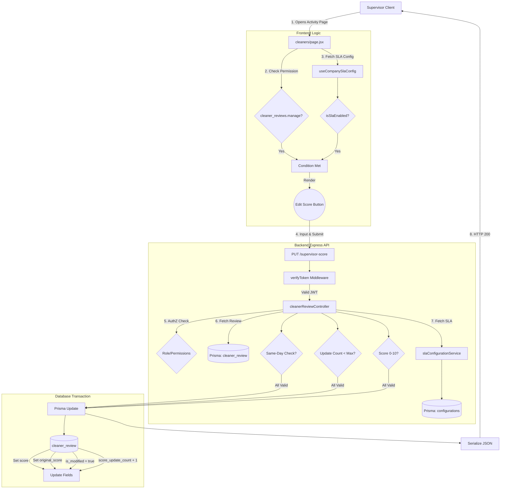

# SLA Engine & Supervisor Score Override - Architecture Documentation (Phase 2)

This document provides a complete architectural walkthrough of the Supervisor Score Override feature implemented in Phase 2 of the SLA Engine. It details the request lifecycle, file responsibilities, permission enforcement, SLA validation, and database interactions.

---

## PART 1: HIGH LEVEL FLOW

The complete request lifecycle for a Supervisor Score Override:

1. **Supervisor opens Cleaner Activity page**: The user (Supervisor) navigates to `/cleaners` on the frontend.
2. **Cleaner Activity cards are loaded**: The frontend fetches paginated cleaner review data and maps it into UI cards.
3. **Frontend decides whether to render Edit Score**: The UI verifies two conditions:
   - Does the user possess the `cleaner_reviews.manage` permission?
   - Is the SLA configuration active (`enabled: true`) for the current `company_id`?
4. **Supervisor clicks Edit**: If both conditions pass, a pencil icon is rendered on the activity card. Clicking it opens the Edit Modal.
5. **Modal opens**: The inline modal captures the desired new score (between 0 and 10).
6. **API Request**: The supervisor clicks "Save", triggering a `PUT` request to `/api/cleaner-review/:id/supervisor-score` via a React Query mutation.
7. **Backend Auth & Permissions**: Express middleware verifies the JWT token. The controller strictly checks for `role_id === 1` (Super Admin) OR the presence of `cleaner_reviews.manage` in the decoded token.
8. **Backend SLA & Validation**: 
   - The backend loads the specific `cleaner_review` from the database.
   - It fetches the SLA Configuration for the associated company.
   - It validates: SLA active state, same-day constraint (review created today), and SLA limit constraint (`max_score_updates_per_activity`).
9. **Database Update**: The backend preserves the original AI score (if not already preserved), updates the current score, marks `is_modified = true`, and increments `score_update_count`. The `hygiene_scores` table is deliberately left untouched.
10. **Response**: The backend returns the newly updated record serialized for JSON.
11. **Frontend Update**: React Query receives the success response, invalidates the `["cleaner-reviews"]` cache, and updates the local state to immediately reflect the new score in the UI.

---

## PART 2: FILE BREAKDOWN

### Frontend Files

*   **`app/(protected)/cleaners/page.jsx`**
    *   **Purpose:** Renders the Cleaner Activity dashboard.
    *   **Responsibility:** Displays activity cards, manages local filter state, evaluates permission and SLA visibility rules, and renders the inline Edit Score modal.
    *   **Called by:** Next.js App Router for `/cleaners`.
    *   **Calls:** `usePermissions`, `useCompanySlaConfig`, `useUpdateSupervisorScore`.

*   **`shared/hooks/usePermission.js`**
    *   **Purpose:** Custom hook for RBAC checks in the frontend.
    *   **Responsibility:** Reads the Redux user state and verifies if the specified `module` and `action` exist in the `user.role.permissions` array.
    *   **Called by:** `cleaners/page.jsx` (and other protected views).
    *   **Calls:** `useSelector` (Redux).

*   **`features/cleanerReview/cleanerReview.queries.js`**
    *   **Purpose:** React Query hooks for Cleaner Reviews.
    *   **Responsibility:** Provides the `useUpdateSupervisorScore` mutation, handling optimistic updates (or cache invalidation) on success or failure.
    *   **Called by:** `cleaners/page.jsx`.
    *   **Calls:** `CleanerReviewApi.updateSupervisorScore`.

*   **`features/cleanerReview/cleanerReview.api.js`**
    *   **Purpose:** Axios API wrapper for Cleaner Reviews.
    *   **Responsibility:** Executes the `PUT` HTTP request to the backend with the review ID and the new score payload.
    *   **Called by:** `cleanerReview.queries.js`.
    *   **Calls:** `axiosInstance.put`.

*   **`features/companies/queries/sla.queries.js` & `features/companies/api/sla.api.js`**
    *   **Purpose:** Data fetching layer for SLA configurations.
    *   **Responsibility:** Provides `useCompanySlaConfig` to fetch the SLA status of a specific company to drive frontend visibility logic.

### Backend Files

*   **`routes/cleanerReviewRoutes.js`**
    *   **Purpose:** Express router for cleaner review endpoints.
    *   **Responsibility:** Maps the `PUT /:id/supervisor-score` route to the `updateSupervisorScore` controller, injecting `verifyToken` middleware.
    *   **Called by:** Main Express App router (`index.mjs`).
    *   **Calls:** `updateSupervisorScore`, `verifyToken`.

*   **`controller/cleanerReviewController.js`**
    *   **Purpose:** Core business logic for cleaner reviews.
    *   **Responsibility:** Houses `updateSupervisorScore`. It performs AuthZ validation, SLA validation, same-day checks, limits checks, and finally executes the Prisma database update.
    *   **Called by:** `cleanerReviewRoutes.js`.
    *   **Calls:** Prisma Client (`cleaner_review.findUnique`, `cleaner_review.update`), `getCompanySLAConfiguration`.

*   **`routes/slaConfigRoutes.js`**
    *   **Purpose:** Express router for SLA settings.
    *   **Responsibility:** Defines routes for fetching and modifying SLAs. Crucially implements `requireSuperAdminOrCompanyMember` to allow supervisors to read (but not edit) their company's SLA config to drive the frontend UI.
    *   **Called by:** Main Express App router.
    *   **Calls:** SLA Controllers.

*   **`services/slaConfigurationService.js`**
    *   **Purpose:** Reusable backend service for SLA retrieval.
    *   **Responsibility:** Queries the `configurations` table for `SLA_CONFIGURATION`, handles fallback defaults, and parses the JSON payload.
    *   **Called by:** `cleanerReviewController.js`.
    *   **Calls:** Prisma Client (`configurations.findUnique`).

---

## PART 3: FRONTEND ARCHITECTURE

The frontend relies on **Next.js (App Router)** and **React Query** for state management.

1.  **State Management & React Query:**
    *   The `cleaners/page.jsx` component uses `useQuery` (via `useCleanerReviews`) to fetch list data.
    *   When the modal submits, `useUpdateSupervisorScore` (a `useMutation` hook) fires. 
    *   On `onSettled` (success or failure), React Query's `queryClient.invalidateQueries(["cleaner-reviews"])` is triggered to force a fresh data pull from the backend, ensuring the UI remains perfectly synced with the database.

2.  **Permission & SLA Hooks:**
    *   The page invokes `const { hasPermission } = usePermissions();` to check `hasPermission("cleaner_reviews", "manage")`.
    *   Simultaneously, `useCompanySlaConfig(companyId, true)` fetches the SLA settings for the currently viewed company.
    *   The derived boolean `isSlaEnabled = slaConfig?.enabled || false;` is calculated.
    *   The UI conditionally renders the Edit button using `{canManageReviews && isSlaEnabled && (<button>...)}`.

3.  **Modal Flow:**
    *   State variables `isEditModalOpen`, `reviewToEdit`, and `newScore` manage the inline modal.
    *   When Edit is clicked, the `reviewToEdit` is populated, and the `newScore` state is pre-filled with the current score.
    *   Upon clicking Save, `handleSaveScore` ensures the input is a valid number between 0-10 before dispatching `updateScoreMutation.mutateAsync`.

---

## PART 4: PERMISSION FLOW

The application utilizes an RBAC (Role-Based Access Control) system embedded in JWTs.

1.  **User Login:** The user authenticates, and the backend generates a JWT containing their `role_id` and an array of granular permissions (e.g., `["users.view", "cleaner_reviews.manage"]`).
2.  **Frontend State:** Redux stores the decoded user object. `usePermissions` hook reads this array to authorize UI components.
3.  **API Invocation:** When the Supervisor triggers the `PUT` request, the JWT is sent in the `Authorization` header.
4.  **Middleware Verification:** The `verifyToken` middleware decodes the JWT and attaches it to `req.user`.
5.  **Controller Enforcement:** Inside `updateSupervisorScore`, the very first check is:
    ```javascript
    if (Number(user.role_id) !== 1 && (!user.permissions || !user.permissions.includes("cleaner_reviews.manage"))) {
      return res.status(403).json({ success: false, message: "Permission denied" });
    }
    ```
    This ensures that even if the frontend UI was bypassed, the backend strictly rejects unauthorized mutations.

---

## PART 5: SLA FLOW

The SLA (Service Level Agreement) module acts as a strict gateway for score modifications.

1.  **Backend Fetch:** Inside the controller, `getCompanySLAConfiguration(companyId)` is called.
2.  **Service Resolution:** The `slaConfigurationService.js` queries the `configurations` table for the row matching `name: "SLA_CONFIGURATION"` and the respective `company_id`.
3.  **Activity Validation:** The controller verifies if `slaConfig.enabled` is `true`. If `false`, the request aborts with a 400 error.
4.  **Parsing Thresholds:** The service parses the JSON stored in the `description` column. The controller extracts `slaConfig.configuration?.max_score_updates_per_activity` (defaulting to 1 if absent).
5.  **Limit Validation:** The controller compares the `cleaner_review.score_update_count` field against this threshold. If `score_update_count >= max_updates`, it throws a "Maximum score updates reached" error.

---

## PART 6: DATABASE FLOW

The architecture carefully orchestrates specific database tables while preserving core reporting data immutability.

*   **`cleaner_review` Table:** 
    *   **Purpose:** Stores the individual rating and feedback for a cleaning task.
    *   **Fields modified in this flow:** 
        *   `score`: Updated to the new manual score.
        *   `is_modified`: Set to `true` to flag manual intervention.
        *   `score_update_count`: Incremented by 1.
        *   `original_score`: Receives the initial AI score *only* on the first update.
        *   `updated_at`: Timestamped.
*   **`hygiene_scores` Table:**
    *   **Purpose:** Master record of daily aggregated scores.
    *   **Rule:** This table is **deliberately NOT updated** during this flow. The SLA Engine separates the immediate review modification from the eventual Daily Score Recalculation (Phase 3).
*   **`configurations` Table:**
    *   **Purpose:** Stores company-specific module settings.
    *   **Important Fields:** `name` ("SLA_CONFIGURATION"), `company_id`, `is_active` (boolean), `description` (JSON payload containing rules).
    *   **Role:** Queried (Read-Only) in this flow to enforce business rules.

---

## PART 7: SUPERVISOR SCORE UPDATE FLOW

Execution sequence from click to completion:

1.  **Supervisor clicks Save** in the frontend modal.
2.  **Request reaches backend:** `PUT /api/cleaner-review/:id/supervisor-score`.
3.  **Authentication:** `verifyToken` middleware validates JWT.
4.  **Permission:** Controller verifies `cleaner_reviews.manage` inside `req.user`.
5.  **Load Cleaner Review:** Prisma fetches the review by `id`. Returns 404 if missing.
6.  **Load SLA:** `getCompanySLAConfiguration` fetches the company's SLA profile. Returns 400 if disabled.
7.  **Same-day validation:** Compares the date (Year, Month, Date) of `review.created_at` against `new Date()`. Returns 400 if they differ.
8.  **Score update count validation:** Checks if `review.score_update_count >= max_score_updates_per_activity`. Returns 400 if limit reached.
9.  **Score validation:** Ensures the parsed numeric score is `0 <= score <= 10`.
10. **Database update:** Prisma runs an `update` query on `cleaner_review` setting the new score, `is_modified: true`, updating `original_score` if null, and incrementing `score_update_count`.
11. **Serialization:** BigInts and Decimal values are scrubbed via `safeSerialize` to prevent JSON parsing errors.
12. **Response:** Status 200 with the serialized updated record.

---

## PART 8: BUSINESS RULES

The following business rules form the backbone of this phase:

1.  **Authorization Constraint:** Only users possessing the `cleaner_reviews.manage` permission (or Super Admins) can initiate an update.
2.  **SLA Dependency:** Score modification is completely disabled unless the Super Admin has activated the SLA Engine for that specific company.
3.  **Same-Day Immutability Lock:** A review can only be modified on the exact calendar day it was created. Historical reviews are permanently locked.
4.  **Update Threshold Limits:** A review can only be updated up to the `max_score_updates_per_activity` value defined in the company's SLA JSON configuration.
5.  **Score Bounds:** Manual scores must be valid integers or floats ranging inclusively from `0` to `10`.
6.  **Table Isolation:** Updates apply exclusively to the `cleaner_review` record. Aggregated metrics like `hygiene_scores` remain untouched pending scheduled recalculations.
7.  **Audit Preservation:** The initial AI-generated score is permanently archived in the `original_score` field on the very first manual edit.

---

## PART 9: RESPONSIBILITY OF EACH MODULE

*   **Authentication & Permission Module:** Responsible exclusively for identity verification and structural access control. Ends the moment the request enters the Controller.
*   **SLA Module:** Acts as the policy engine. Responsible for dictating *if* and *how many times* a specific action can occur based on company agreements. It does not perform the action itself.
*   **Cleaner Review Module (Backend):** The orchestrator. Responsible for gathering data, consulting the SLA module, applying time-based business rules, and performing safe database mutations.
*   **Database (Prisma):** Responsible for schema integrity (types, BigInt references) and persisting data.
*   **Frontend (React/Next.js):** Responsible for conditionally presenting capabilities (the Edit button) to authorized users, capturing inputs, and reflecting the synchronized state of the database to the human user.

---

## PART 10: CURRENT ARCHITECTURE SUMMARY


